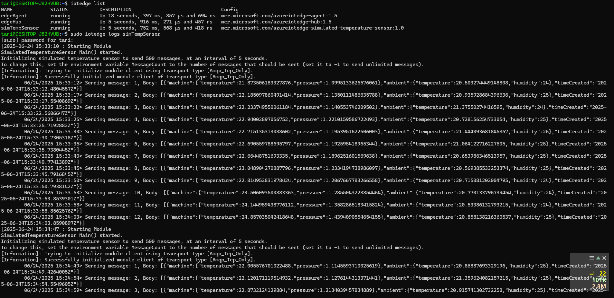
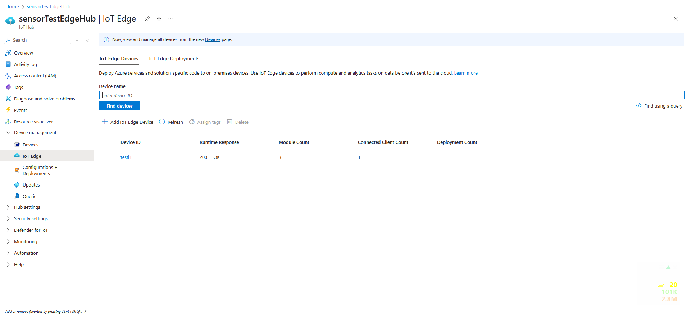

# Azure IoT Edge on Ubuntu (WSL2)

This repository documents my experience setting up and working with Azure IoT Edge on a local Linux machine using **Ubuntu 24.04** via **WSL2**.

I successfully configured an **IoT Edge device** using Microsoft's `aziot-edge` runtime, registered it in **Azure IoT Hub**, and deployed the **Simulated Temperature Sensor** module. This setup validates connectivity and demonstrates real-time telemetry flow from a Linux host to Azure.

In the future, I plan to replace the simulated sensor with a custom python script that collects data from my local machine's hardware sensors.

---

## ✅ Running Modules

The Edge device is running the following modules:

---

## 📡 Azure IoT Hub Confirmation

The device is visible and reporting successfully to the Azure IoT Hub:

