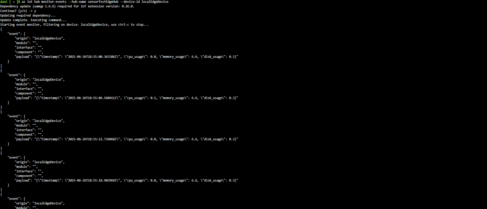
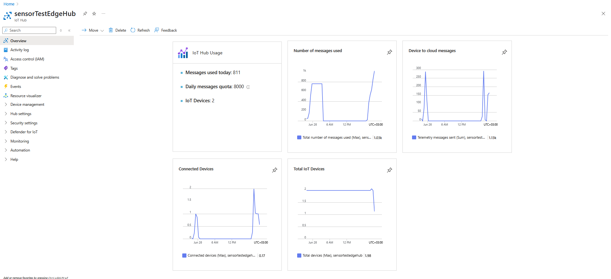
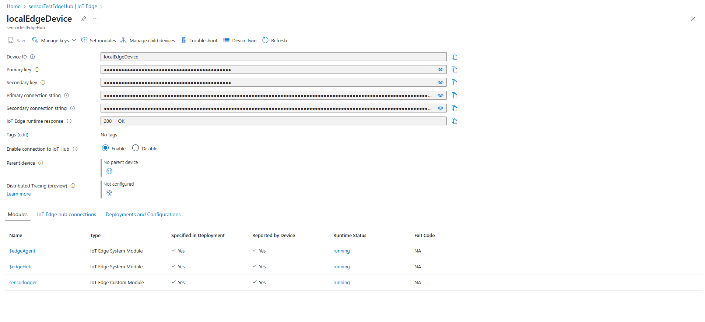
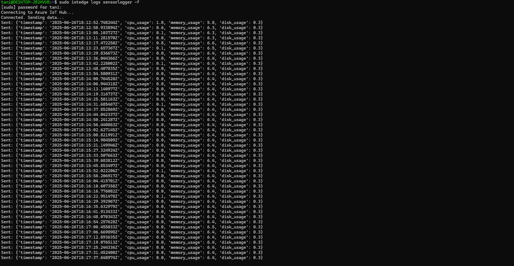
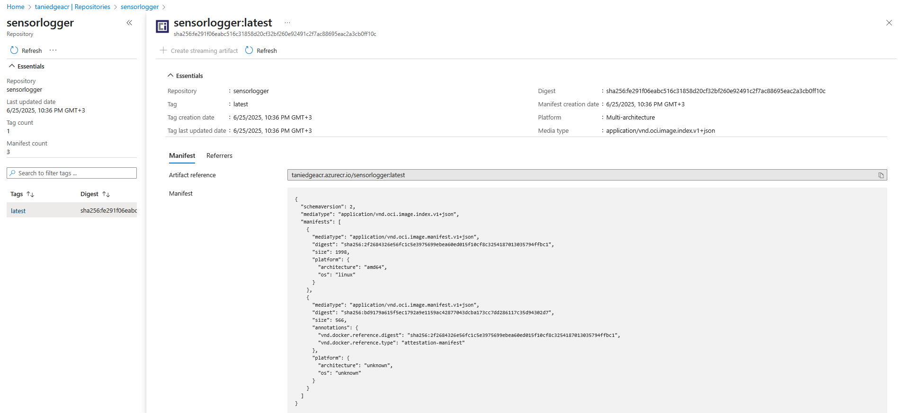
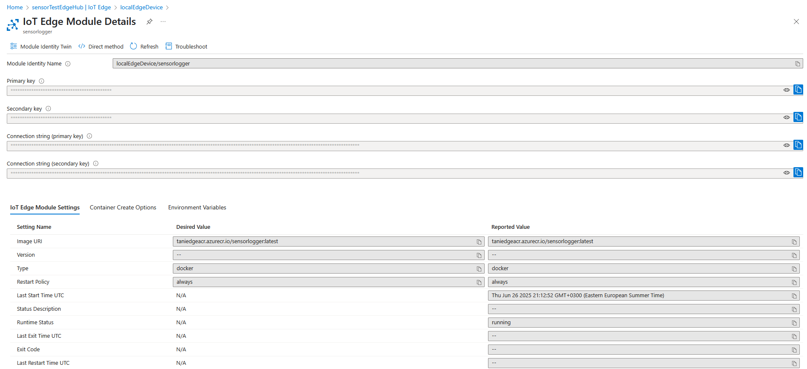

# IoT Edge System Telemetry Module

The current iteration of this project deploys a single IoT Edge module on WSL2 (`sensorlogger`) that collects and sends basic system telemetry from an edge device to Azure IoT Hub.

## 📌 Overview

- **Module**: `sensorlogger`
- **Platform**: Azure IoT Edge (Linux)
- **Language**: Python 3.11
- **Containerization**: Docker → Azure Container Registry (ACR)
- **Telemetry Includes**:
  - CPU usage
  - Memory usage
  - Disk usage
  - UTC timestamp

## 🔧 Key Features

- Uses `psutil` to gather system metrics
- Sends JSON-formatted messages every 5 seconds
- No reliance on Microsoft IoT base images (uses standard `python:3.11`)


## 🔁 Sample Telemetry Payload
```json
{
  "timestamp": "2025-06-26T18:55:00.363867Z",
  "cpu_usage": 0.0,
  "memory_usage": 6.6,
  "disk_usage": 0.3
}
```
## 🚧 Future Plans

- Logic separation into multiple modules
- Implement cloud-to-device (C2D) messaging support
- Support direct method invocation from the cloud
- Running the device and modules on Linux Ubuntu 22.04.5 on my laptop and using it via SSH
- Build a custom "thermostat" using an ESP32 with a temperature sensor + 5v relay
- Read and process live data from the ESP32 thermostat
- Connecting data stream to Power BI (If I get Microsoft dev program access)


📸 Screenshots











